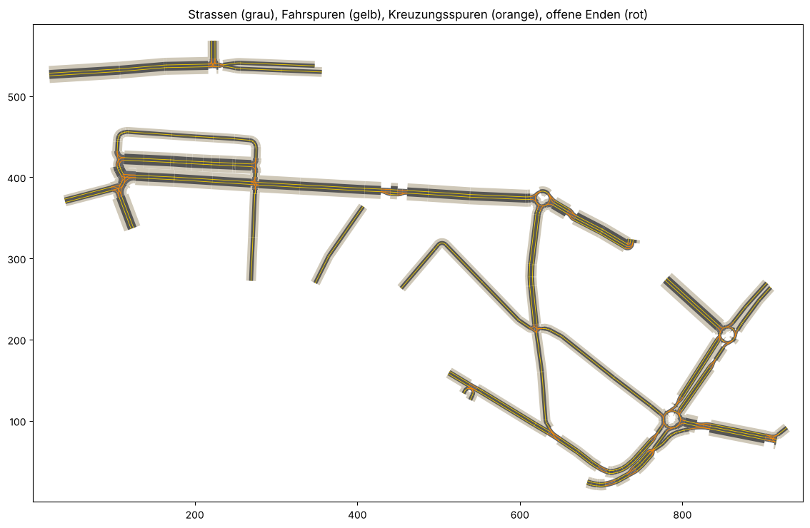

# aschaffenburgmap – reale Strecken als OMSI-2-Karte

`omsigen` baut aus OpenStreetMap-Daten eine befahrbare OMSI-2-Karte: Man gibt eine Stadt, Start und Ziel ein,
das Tool sucht die Strecke über das echte Straßennetz und erzeugt alle Straßen in einem Korridor darum –
mit Kreuzungen, deren Fahrspuren exakt verbunden sind.



## Schnellstart (Windows)

```powershell
pip install -r requirements.txt
python -m omsigen --omsi "C:\Program Files (x86)\Steam\steamapps\common\OMSI 2" `
    --stadt Aschaffenburg --von "Hauptbahnhof" --nach "City Galerie" `
    --name Aschaffenburg_Hbf_CityGalerie --vorschau vorschau.png
```

Die Karte erscheint danach in OMSI bzw. im nEditor unter dem angegebenen Namen. Vorhandene Karten werden nie
überschrieben (außer mit `--ueberschreiben` für denselben Namen).

| Option | Bedeutung |
|---|---|
| `--von`, `--nach` | Ortsname (mit `--stadt`) oder Koordinaten `"49.9805,9.1402"` |
| `--ueber` | Zwischenziel, mehrfach möglich – damit lässt sich eine Buslinie nachfahren |
| `--breite` | Korridor links/rechts der Strecke in Metern (Standard 150) |
| `--omsi` | OMSI-Ordner: Karte und eigene Splines werden direkt installiert |
| `--ausgabe` | ohne `--omsi`: Ausgabe in diesen Ordner (Standard `build/`) |
| `--osm-datei` | Daten aus Datei statt Download, z. B. `samples/aschaffenburg_hbf_citygalerie.json` |
| `--korrekturen` | eigene Korrekturen (Vorfahrt), JSON |
| `--ansicht` | interaktive HTML-Ansicht der fertigen Karte |

Ohne Internet/OMSI ausprobieren:

```bash
python -m omsigen --von "49.98053,9.14023" --nach "49.97790,9.14998" --name Test \
    --osm-datei samples/aschaffenburg_hbf_citygalerie.json --vorschau vorschau.png
python -m pytest
```

## Karteneditor (Programm)

```powershell
python -m omsieditor                      # Startdialog: OSM-Import, leer anfangen oder Projekt öffnen
python -m omsieditor mein.omsiprojekt     # Projekt direkt öffnen
```

- **Hintergrund:** amtliches Luftbild der Bayerischen Vermessungsverwaltung (DOP40, 40 cm, CC BY 4.0, kostenfrei),
  wird beim Zoomen nachgeladen und zwischengespeichert (`.cache/luftbild`)
- **Auswählen (V):** Straße anklicken, Klasse/Name/Spuren/Einbahn/Tempo/Vorfahrtstraße rechts ändern, Punkte ziehen
  (gemeinsame Kreuzungspunkte wandern mit), Alt+Klick löscht einen Punkt, Entf löscht die Straße
- **Straße zeichnen (S):** Klick setzt Punkte und rastet an vorhandenen Straßen ein – dort entsteht automatisch
  eine Kreuzung; Doppelklick, Enter oder Rechtsklick beendet
- Mausrad zoomt, rechte oder mittlere Maustaste verschiebt; Strg+Z/Strg+Y; Speichern als `.omsiprojekt`
- **Karte erzeugen (Strg+E):** baut die OMSI-Karte mit omsigen (Kreuzungsobjekte, Vorfahrt, Ampeln,
  Wendeschleifen), prüft sie und zeigt auf Wunsch ein Spielbild aus openOMSI

## Karten prüfen und ansehen

```powershell
# beliebige Karte lesen (eigene oder Standardkarten), Anschlüsse prüfen, Draufsicht + interaktive Ansicht
python -m omsigen.ansicht Aschaffenburg_Live_v1 --png build/ansicht.png --html build/ansicht.html
python -m omsigen.ansicht Grundorf --png build/kreuzung.png --bereich=340,-230,420,-150

# Karte im Nachbau openOMSI laden und ein Spielbild rendern (Kamera: x,y,z,gier,neigung in Kartenmetern)
python -m omsigen.openomsi Aschaffenburg_Live_v5 --png build/spiel.png --cam 390,320,60,0,-40 --verkehr 40 --sekunden 40
```

`omsigen.ansicht` ersetzt „Show paths“ im nEditor: Fahrspuren, Gehwege, Vorfahrt-Regeln, Ampelpfade und
Kreuzungsobjekte; Klick auf eine Spur zeigt Spline/Objekt, Datei, Kachel und Pfad-Index. Gemeldet werden
„Beinahe-Anschlüsse“ (Spurenden mit Partner in ≤ 5 m, aber nicht exakt verbunden). Beim Generator erzeugt
`--ansicht build/x.html` die Ansicht gleich mit. `omsigen.openomsi` braucht
[openOMSI](https://github.com/openOMSI-Project/openOMSI) unter `Documents\OpenOmsi`.

## Was das Tool kann

- Strecke über das echte Straßennetz (Einbahnstraßen beachtet), Korridor drumherum
- Straßen aus Geraden und Kreisbögen, Spurenzahl und Einbahnstraßen aus OSM, getrennte Richtungsfahrbahnen
- **Kreuzungsobjekte**: jede Kreuzung wird ein eigenes OMSI-Objekt wie in den Standardkarten – eine
  durchgehende Platte (.x-Modell) aus Asphalt, Bordsteinen und gerundeten Gehwegecken, dazu die Abbiege-,
  Geradeaus- und Gehwegpfade, die exakt an die Straßen anschließen; Mittelinseln bei getrennten Fahrbahnen,
  Kreisverkehre (`--kreuzungen spline` baut noch wie früher nur aus Spur-Splines)
- Gehwege an Einbahnstraßen nur dort, wo daneben Platz ist (Bypässe, Richtungsfahrbahnen)
- **Vorfahrt nach realem Vorbild** (`omsigen/vorfahrt.py`): aus OSM-Schildern (Vorfahrt gewähren, Stopp),
  Vorfahrtstraßen (`priority_road`), Kreisverkehren, StVO-Regeln (Tempo-30-Zone, Ausfahrt aus Zufahrten) und
  zuletzt der Straßenklasse. Prioritäten wie in den Standardkarten (192/64, siehe docs/kartenstudie.md). Jede
  Kreuzung vermerkt ihre Quelle; die HTML-Ansicht zeigt sie farbig (orange = nur vermutet).
- **Korrekturdatei** `--korrekturen korrekturen/<stadt>.json`: Hauptstraße oder „rechts vor links“ je Kreuzung
  festlegen, vermutete Vorfahrt bestätigen (`"bestaetigt": true`), Ampel erzwingen/abschalten (`"ampel"`)
  (Vorlage: `korrekturen/beispiel.json`, Koordinaten per Klick in der HTML-Ansicht)
- **Ampeln** (`omsigen/ampel.py`) an Kreuzungen mit OSM-Ampel: Phasenplan (gegenüberliegende Arme gemeinsam,
  Hauptstraße zuerst, Umlauf 70–100 s), Bindung der Zufahrten, Signalmasten mit Signal unten und am Ausleger
  wie in Grundorf
- **KI-Verkehr**: `ailists.cfg` mit den Standard-KI-Autos und -LKW, Tagesganglinie des Verkehrs; unsichtbare Wendeschleifen an
  Straßenenden (Kartenrand, Sackgassen), damit die KI dort nicht stecken bleibt
- Haltestellenschilder an den OSM-Haltestellen
- automatische Prüfung jedes Spurendes + Draufsicht als PNG

## Noch offen (Roadmap)

1. Fußgängerampeln und Fußgängerquerungen (Zebrastreifen); Ampeln und Vorfahrt sind erledigt
3. Höhen (SRTM bzw. amtliches DGM)
4. Haltestellen mit Haltepunkten, Linien und Fahrplänen (aus GTFS-Daten)
5. Gebäude (OSM-Umrisse, ggf. LoD2-Modelle), Bäume, Straßenmöbel
6. Tunnel und Brücken (werden derzeit weggelassen)

## Projektaufbau

```
omsigen/
  cli.py            Kommandozeile
  pipeline.py       Import (OSM -> Projekt) und Erzeugen (Projekt -> Karte), gemeinsam fuer CLI und Editor
  osm.py            Ortssuche (Nominatim), Download (Overpass), Zwischenspeicher
  route.py          Projektion, Routing (Dijkstra), Korridor
  network.py        Kanten, Knoten, Kreisverkehre, Kürzen, Ketten, Kreuzungsspuren
  kreuzung.py       Kreuzungsobjekte: Fläche, Bordsteine, Pfade -> .sco + .x
  vorfahrt.py       Vorfahrt je Kreuzung (Schilder, Vorfahrtstraßen, StVO, Korrekturen)
  ampel.py          Ampelprogramme, Bindung der Zufahrten, Signalmasten
  studie.py         vorhandene OMSI-Karten auswerten (docs/kartenstudie.md)
  geom.py           Geraden/Bögen/Doppelbögen in OMSI-Konvention
  config.py         welche Spline für welche Straße
  custom_splines.py eigene .sli (Einbahnstraßen, Kreuzungsspuren)
  splinedb.py       Fahrspuren aus .sli lesen
  writer.py         Kartenordner schreiben
  check.py          Spurprüfung und Vorschau
  ansicht.py        Karten-Betrachter für beliebige OMSI-Karten (PNG, HTML, Bericht)
  openomsi.py       Karte in openOMSI rendern, dessen Pfadnetz-Auswertung lesen
omsieditor/         Karteneditor (PySide6): Startdialog, Kartenansicht mit Luftbild, Eigenschaften, Export
docs/omsi-format.md alles, was wir über das Dateiformat wissen
samples/            Testdaten (OSM-Auszug Aschaffenburg)
```

Benötigt die Standardinhalte von OMSI 2 (Splines `Marcel`, `template/NewMap`); diese werden nicht mitgeliefert.

## Daten und Lizenz

Straßendaten © OpenStreetMap-Mitwirkende, verfügbar unter der
[Open Database License](https://www.openstreetmap.org/copyright). Erzeugte Karten enthalten einen
entsprechenden Hinweis; beim Weitergeben bitte beibehalten.
